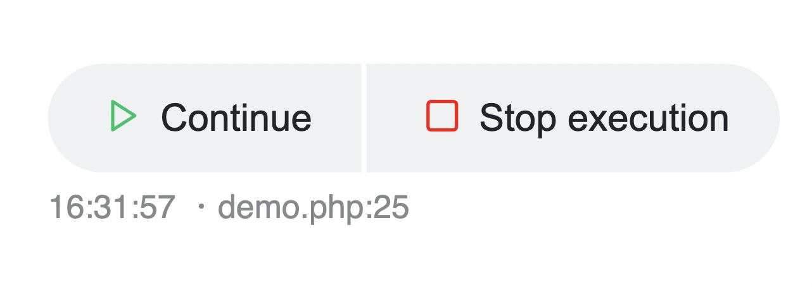

# xri

Use `xri()` to interact with the inspector.

## Pause

💡 Supports body `body`, topic `t`, emote `e` and flags `f` arguments.

```php
xri()->pause();
xri()->pause(t: 'stop', e: '⏯');
```

Calling `pause` enables to control execution from the debugger:



## Memory

💡 Supports topic `t`, emote `e` and flags `f` arguments.

```php
xri()->memory();
xri()->memory(f: XR_BACKTRACE);
```

Calling `memory` send the memory usage information to the debugger.

