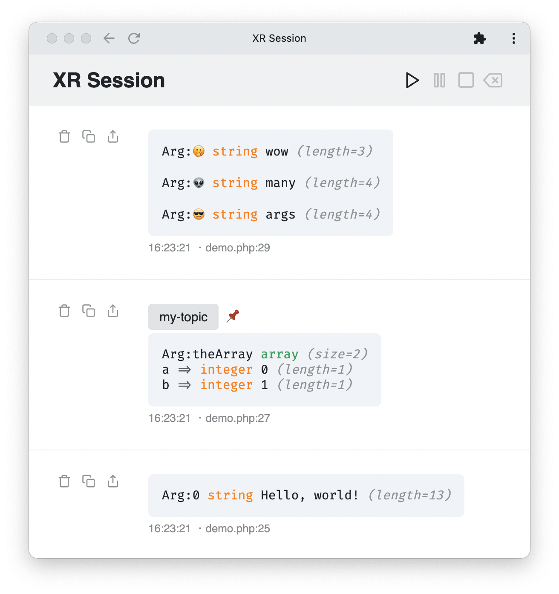

# Get started

## What is xrDebug?

xrDebug is a dump debug utility providing an [application server](../running/README.md) where you can send debug payloads, and stream these messages to multiple peers in any web browser.

Here's, this is what you write in your code:

```php
xr('Hello, world!');

xr(theArray: ['a' => 0, 'b' => 1], t: 'my-topic', e: '📌');

xr(🤭: 'wow', 👽: 'many', 😎: 'args');
```

Here's how it looks in xrDebug:



There are other [helper functions](../helpers/README.md) that allow you to show system information, pause your code, etc. You can easily build your own custom helpers to dump functions tailored for your specific application context.

## How it works?

* xrDebug listens to messages emitted from your code.
* Calls to xrDebug helpers in your code emit a message to server.
